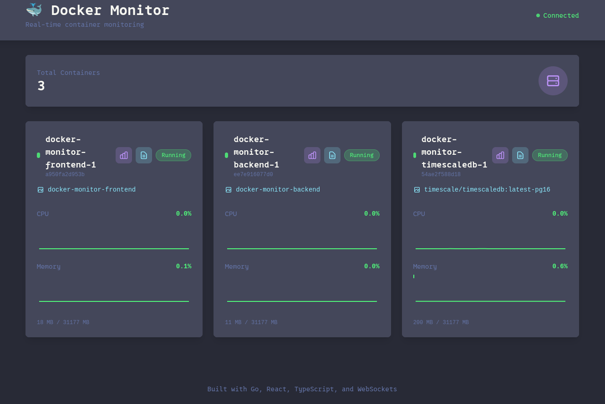
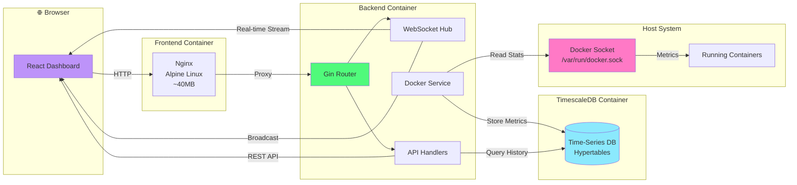
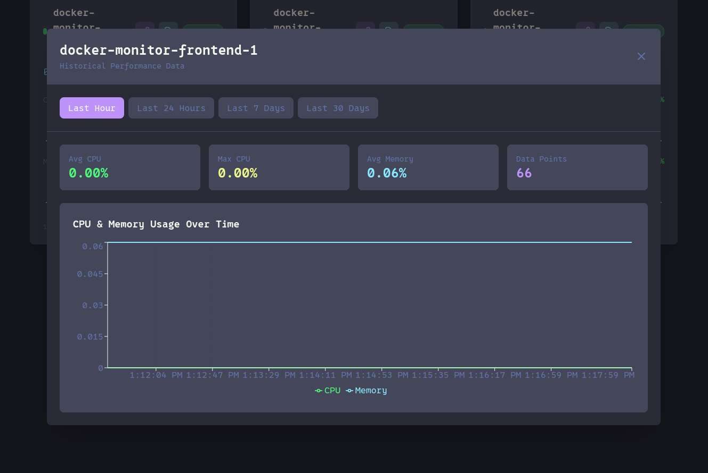
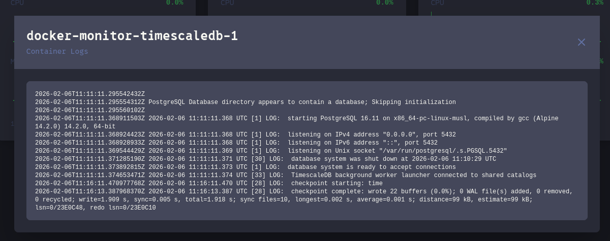

# 🐳 Docker Monitor

Homelab ready real-time Docker container monitoring system with historical analytics.



## ✨ Features

- ⚡ **Real-time monitoring** - WebSocket updates every 2 seconds
- 📊 **Historical data** - View trends over 1h, 24h, 7d, 30d
- 📜 **Container logs** - Built-in log viewer
- 🎨 **Beautiful UI** - Dracula-themed dashboard
- 💾 **TimescaleDB** - Optimized time-series storage
- 🔒 **Security** - Non-root containers, minimal images
- 🐳 **Docker native** - Monitors all containers on host

## 📋 TODO 

- [ ] Live log streaming 
- [ ] Container control buttons (start/stop/restart)
- [ ] Alert system for high resource usage 
- [ ] Search and filer containers

## 🏗️ Architecture


## 🚀 Quick Start
```bash
git clone https://github.com/rusenback/docker-monitor-web
cd docker-monitor
docker compose up -d
```

Access at http://localhost:3000

## 📸 Screnshots

## Graphs




## 🛠️ Tech Stack

**Backend:**
- Go 1.23
- Gin web framework
- Docker SDK
- WebSockets
- PostgreSQL driver

**Frontend:**
- React 18
- TypeScript
- Bun
- Recharts
- Tailwind CSS

**Database:**
- TimescaleDB (PostgreSQL + time-series)

**Infrastructure:**
- Docker & Docker Compose
- Multi-stage builds
- Non-root containers
- Alpine Linux base

## 🔐 Security Features

- Non-root containers
- Read-only Docker socket
- Minimal base images
- No unnecessary capabilities
- Security headers

## 📝 License

MIT- Go 1.23

